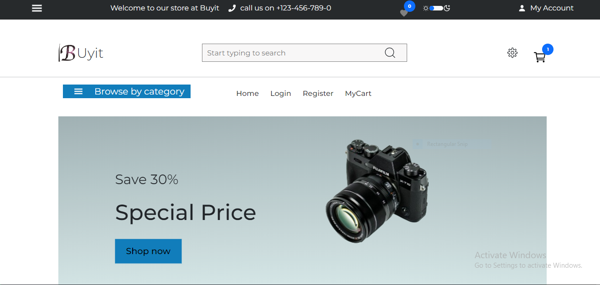

# Project Title

## Configuration

- **Global State Management**: The global state for the entire application is managed from the "app" level in `app.js`.

- **Backend API Configuration**: Whenever links to the backend application change, the only place to update it is in the `apiEntry.ts` file located in the `src` directory. Never redefine the API entry point anywhere else in the application to maintain organization.

## Home Page Behavior

On the home page, if a token is recognized, the data is fetched and the application state is changed as reducers are dispatched.
